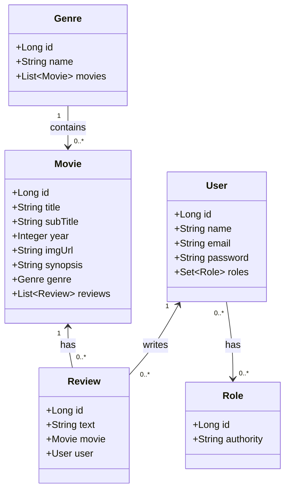
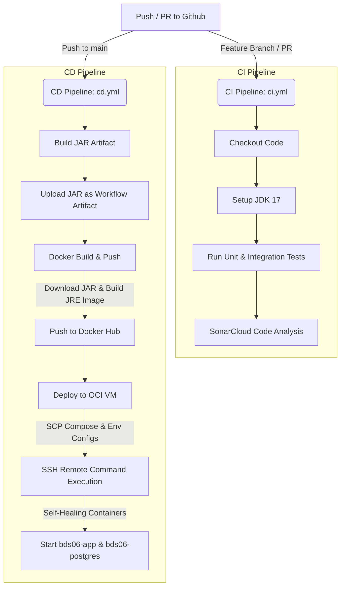

# 🎬 Movieflix Backend Application

<div align="center">
  
  
  
  
  
  
  <a href="https://bds06-homolog.felipeschirmann.dev.br/swagger-ui/index.html">
    
  </a>
</div>

<p align="center">
  <b>A premium, high-performance Spring Boot REST API for the Movieflix ecosystem. Fully dockerized, security-hardened, and orchestrated with modern CI/CD automation.</b>
</p>

---

## 📖 Table of Contents
1. [Key Features & Architecture](#-key-features--architecture)
2. [Domain Model (UML)](#-domain-model-uml)
3. [CI/CD Workflow Architecture](#-cicd-workflow-architecture)
4. [🛠️ Local Development & Quick Start](#%EF%B8%8F-local-development--quick-start)
5. [🐳 Docker Compose Containers](#-docker-compose-containers)
6. [🎯 Testing & Verification](#-testing-&--verification)
7. [🔗 API Documentation & Useful Links](#-api-documentation--useful-links)

---

## 🚀 Key Features & Architecture

* **OAuth2.0 & JWT Authentication**: Token-based security server utilizing roles (`ROLE_VISITOR`, `ROLE_MEMBER`) to restrict resource actions dynamically.
* **Database Migration & Seed**: Ephemeral database seeding on target environments leveraging native Spring Boot profiles and automatic execution of SQL seed files.
* **Optimal CI/CD Restructuring**: Split testing (`ci.yml`) and compiler compilation/container deployment (`cd.yml`) to keep builds clean and fast.
* **Rapid Multi-Stage Docker Builds**: Speeds up GHA container compilations from minutes to under 45 seconds using cached compiler JAR dependencies.

---

## 🗺️ Domain Model (UML)

The following diagram illustrates the relational layout of the database schema:



---

## ⚙️ CI/CD Workflow Architecture

This workflow isolates Continuous Integration checks (PR validation) from Continuous Deployment runs (main branch builds):



---

## 🛠️ Local Development & Quick Start

Follow these steps to set up the application in your workspace:

### 1. Runtime Environment (SDKMAN!)
We use **Java 17 (17.0.10-tem)** configured via a local `.sdkmanrc` file. 

* Ensure you have [SDKMAN!](https://sdkman.io/) installed.
* Switch to the project JVM version:
  ```bash
  sdk env
  ```

### 2. Environment Variables Configuration
The project loads configurations from local environment files. To set up your local development credentials:

1. Copy the sample environment file:
   ```bash
   cp .env.homolog.example .env.homolog
   ```
2. Adjust the values inside `.env.homolog` for database port bindings and OAuth client secrets.

---

## 🐳 Docker Compose Containers

We maintain separate environments optimized for development and isolated cloud verification:

### A. Local Development (Multi-Stage Build)
Compiles, tests, and builds the container from source code. Runs the API alongside a PostgreSQL service:
```bash
docker compose up --build -d
```
* **API Endpoint**: `http://localhost:8080`
* **PostgreSQL Port**: `5432`

### B. Ephemeral Homolog VM (Self-Healing Fallbacks)
Deploys pre-built Docker Hub images directly to a remote host. Features built-in environment fallbacks for zero-downtime boots even in the absence of `.env` files:
```bash
docker compose -f docker-compose-homolog.yml up -d
```
* **Homolog API Endpoint**: `http://localhost:8081` (leaves port `8080` free for other apps)
* **Homolog PostgreSQL Port**: `8082` (prevents database port conflicts)

---

## 🎯 Testing & Verification

Manage, run, and report on all automated validations:

| Command | Purpose |
| :--- | :--- |
| `APP_PROFILE=test ./mvnw clean test` | Runs the full Unit Test suite |
| `APP_PROFILE=test ./mvnw clean verify` | Runs Unit + Integration Tests and outputs **JaCoCo** reports |
| `docker image prune -a -f` | Cleans up intermediate images and cached builder layers |

> [!TIP]
> View coverage analytics locally in your browser by opening:
> `target/site/jacoco/index.html`

---

## 🔗 API Documentation & Useful Links

When running the application locally under the `test` or `dev` profiles:

* **Swagger Interactive UI**: [http://localhost:8080/swagger-ui/index.html](http://localhost:8080/swagger-ui/index.html)
* **OpenAPI Specs (JSON)**: [http://localhost:8080/v3/api-docs](http://localhost:8080/v3/api-docs)
* **H2 Database Console**: [http://localhost:8080/h2-console](http://localhost:8080/h2-console)
  * *JDBC URL*: `jdbc:h2:mem:testdb`
  * *User*: `sa`
  * *Password*: *(blank)*